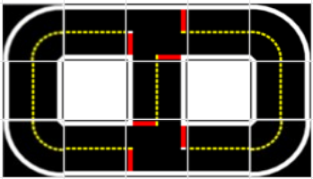
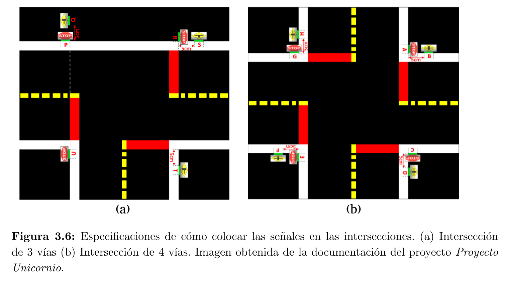
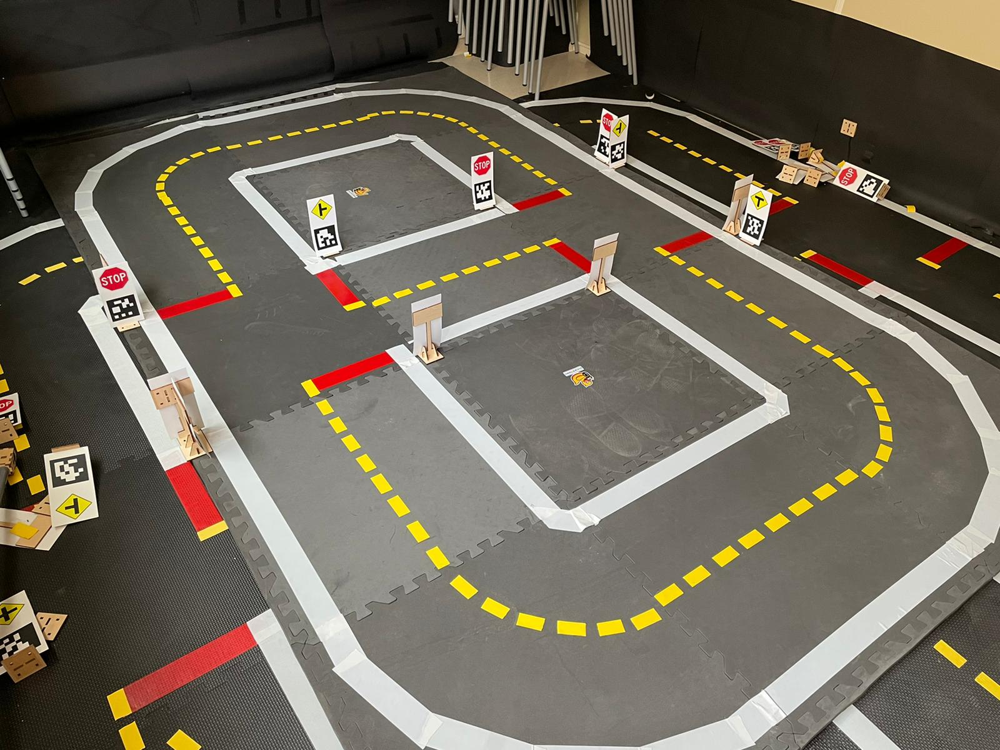
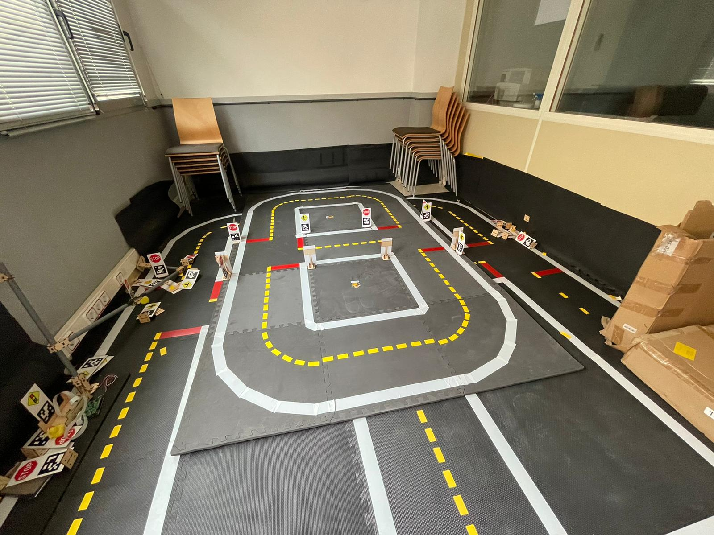
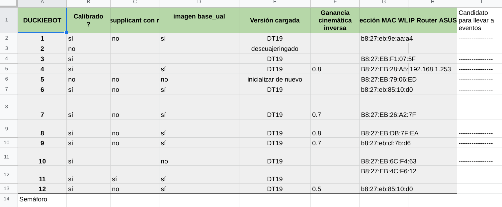
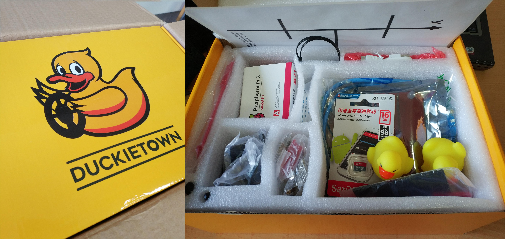
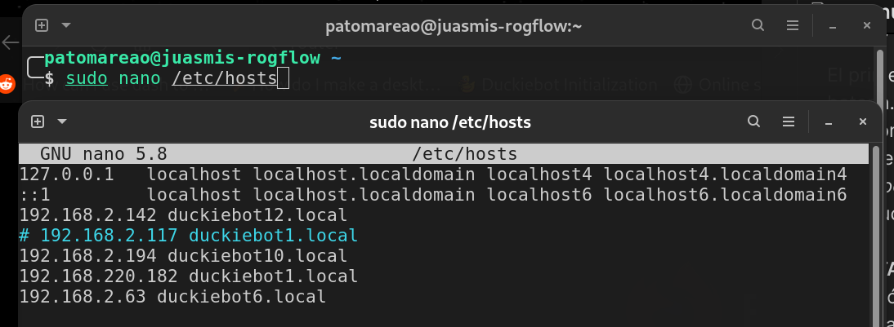
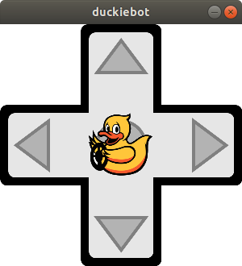

# Manual de puesta en marcha de la ciudad compacta
Para eventos como la noche de los investigadores, etc

## Ciudad
Diseño:


Colocación de las señales:


Ciudad montada:


## Patos
Comprobar hoja de cálculo Estado laboratorio para encontrar los patos más aptos (aunque probablemente para cuando se use ya esté desactualizada y no sirva de mucho)


#### Materiales necesarios
Un *duckiebot* y un equipo con el *software* necesario para interactuar con él. 
- Batería cargada



#### Pasos a seguir
El primer paso es encender el robot conectando los dos cables a la batería. Automáticamente se encenderán las luces, si no es así pulsar el botón en el lateral de la batería. Tras un tiempo o cuando se apaguen las luces del robot probar si hay comunicación con la *Raspberry* haciendo: `ping duckiebotX.local`. 


Si no funciona introducir directamente la dirección IP en lugar del nombre de *host*.

**NOTA:** Sustituir en todos los comandos donde se indica `duckiebotX`, la X por el número del *duckiebot* usado.

**NOTA:** Si no funciona así, hay que hacerlo introduciendo la dirección IP que se mostrará en clase, y además añadir una nueva entrada en el archivo `/etc/hosts` como se muestra:



Pulsar `CTRL+X` para salir y confirmar para guardar.

### Ejecución de demos
Hay varias maneras de ejecutar las distintas demos disponibles, gráficamente o a través de la terminal. A continuación se exponen.

#### Portainer
A través de la interfaz gráfica de *Docker* (*Portainer*), se pueden acceder a los distintos contenedores previamente creados (en un navegador en la barra de búsqueda introducir `duckiebotX.local:9000`):


A continuación buscar el contenedor con el nombre de la demo de interés y pulsar sobre `>_` para inicar su ejecución. Esta aproximación depende de que el contenedor se haya creado previamente.

**LIMITACIONES**. El contenedor mantendrá la configuración con la que se dejó en la última ejecución, esto quiere decir, que si por ejemplo la red a la que el robot esté conectado ha cambiado, y por lo tanto lo ha hecho la dirección IP asignada, no funcionará correctamente.

#### Herramienta del proyecto. *Duckietown Shell*
Si se dispone de un equipo con la herramienta *duckietown shell* instalada y configurada, se pueden ejecutar los contenedores con los programas de interés. A diferencia de la aproximación anterior, automáticamente borrará el contenedor anterior y creará otro nuevo con la configuración adecuada. Si se han hecho cambios en la configuración en el contenedor anterior se perderán.

- Demos básicas:
	- Control manual. Para permitir el control con el mando.
	```bash
	dts duckiebot demo --demo_name joystick --duckiebot_name duckiebotX
	```
	- Base. Demo que inicia un contenedor a partir de la imagen base, la cual contiene todo el *software* del proyecto y es a partir de la cual se inician todas las demos avanzadas. Útil para ejecutar posteriormente cualquier programa.
	```bash
	dts duckiebot demo --demo_name base --duckiebot_name duckiebotX
	```
	
- Demos avanzadas:
	- Seguimiento de líneas. Los patos intentan seguir las marcas de la carretera y circular por la ciudad.
	```bash
	dts duckiebot demo --demo_name lane_following --duckiebot_name duckiebotX --package_name duckietown_demos
	```
	- Navegación indefinida. Demo donde los patos circulan por la ciudad siguiendo las líneas y respetando (o intentando) las señales.
	```bash
	dts duckiebot demo --demo_name lane_following --duckiebot_name duckiebotX --package_name duckietown_demos
	```

**NOTA**: Añadir opción `--debug` a intrucciones anteriores para poder ver mensajes devueltos por la ejecución de los programas. 

Control manual:
```bash
roslaunch duckietown joystick.launch veh:=duckiebotX
```

Demos avanzadas:
```bash
roslaunch duckietown_demos lane_following.launch veh:=duckiebotX
```

#### Usando *Docker*
Acceder a un contenedor creado a partir de la imagen base mediante cualquiera de los dos métodos explicados anteriormente y ejecutar la demo de interés con:


### Obtención de mando para controlar vehículos

Se obtiene ejecutando en una terminal la iguiente instrucción:
```bash
dts duckiebot keyboard_control duckiebotX
```


### Configuración de parámetros cinemática y controlador
Para configurar los parámetros se accede a cualquier contenedor donde se tenga acceso a ROS y se ejecutan las siguientes instrucciones:
```bash
rosservice call /duckiebotX/inverse_kinematics_node/set_gain -- VALOR
```
```bash
rosservice call /duckiebotX/inverse_kinematics_node/set_trim -- VALOR
```

Sustituyendo `VALOR` por los valores adecuados. Por defecto la ganancia es 1 y el desvío 0.

Donde con `set_gain` se especifica la ganancia y con `set_trim` el desvío.

Una vez encontrados valores que generan un desempeño satisfactorio guardar con:
```bash
rosservice call /duckiebotX/inverse_kinematics_node/save_calibration
```
Esto guardará los parámetros en un archivo en la RPi, por lo tanto es independiente del contenedor y afectará a todos los demás.

#### Controlador
Para ajustar la ganancia proporcional del controlador que se asegura de que el robot se mantanga en el centro del carril.
```bash
rosparam set /duckiebotX/lane_controller_node/k_d -- VALOR
```
Para la ganancia integral:
```bash
rosparam set /duckiebotX/lane_controller_node/k_Id -- VALOR
```

Una forma de determinar si la ganancia integral es lo suficientemente grande, es, si cuando el *duckiebot* se encuentra pisando alguna de las líneas es muy pasivo (tarda mucho en corregir la trayectoria) en volver al centro de carril, entonces hay que aumentar la ganancia. La ganancia proporcional se ve por los cambios inmediatos que hace el *duckiebot* frente a errores, se ve por la intensidad instantánea que hace el vehículo para volver al centro del carril.

**NOTA:** Hay otro controlador para asegurarse de que la orientación del robot es la correcta, se ajusta de igual manera que lo explicado anteriormente, siendo los parámetros k_phi y k_Iphi para las ganancias proporcional e integral respectivamente. 

**Resultado esperado**: un *duckiebot* que es capaz de navegar satisfactoriamente por la ciudad siguiendo las marcas de la carretera:


### Configuración parámetros visión
Una vez más acceder a un contenedor cualquiera, por ejemplo:
```bash
dts start_gui_tools duckiebotX
```
Activar publicación de imágenes de filtro de bordes, color y segmentos detectados con:
```bash
rosparam set /duckiebotX/line_detector_node/verbose true
```
Finalmente abrir ventana gráfica con imágenes con:
```bash
rqt_image_view
```


Resultado:


## Información adicional
- Documentación del proyecto: [link](https://docs.duckietown.org/DT19/opmanual_duckiebot/out/index.html)
- Repositorio en GitHub de práctica: [link](https://github.com/Juasmis/duckietown_clase_practica)
- Instalar duckietown_shell: [https://github.com/duckietown/duckietown-shell](https://github.com/duckietown/duckietown-shell)
- Instalar docker: [https://docs.docker.com/engine/install/](https://docs.docker.com/engine/install/)
	Una vez instalado, para no tener que ser root:
	```bash
	sudo groupadd docker
	```
	
	```bash
	sudo usermod -aG docker $USER
	```

### Forma alternativa de generar mando
Desde una terminal cambiar al directorio raíz donde están todos los programas del *duckiebot* clonados en el ordenador de sobremesa y ejecutar la instrucción `make`:
```bash
cd Software
```

```bash
make virjoy-duckiebotX
```

Resultado esperado:


### Comando para meterse en un contenedor ya en funcionamiento y ver mensajes
```docker
docker -H duckiebotX.local attach clase_practica2
```

### Iniciar nueva terminal en contenedor en ejecución
```docker
docker -H duckiebotX.local exec -it clase_practica2 bash
```

### Ver valor actual de parámetros
```shell
rosparam get /direccion/al/nodo
```